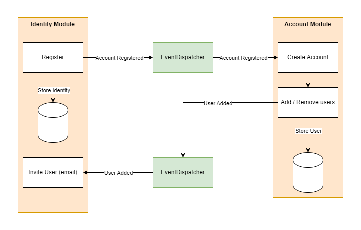

# Tyche - A SaaS Starter

Tyche is a boilerplate / starter app for a Software as a Service (SaaS). It is built with ASP.NET Core on .NET 6 with React.js on the front-end.
It contains all the boilerplate all saas apps must have like a account & user system that supports both normal and B2B customers. 
Authentication & Authorization solution and crucial services like password reset and automatic email sending etc.

## Getting Started 🚀
1. make sure you have .NET 6 sdk installed, you can [find it here](https://dotnet.microsoft.com/en-us/download/dotnet/6.0)
2. add configuration to appsettings.json, when developing locally you can set storage connection strings to `UseDevelopmentStorage=true` and use [azurite](https://github.com/Azure/Azurite) to emulate azure blob storage
3. open the solution in Visual Studio or Rider and you are good to go.  

*In order to run integration tests you need to have docker installed, you can [get it here](https://www.docker.com/)*

## Configuration 🔧
You need to set some environment variables, your `appsettings.json` should follow this structure:

```json
{
  "Logging": {
    "LogLevel": {
      "Default": "Information",
      "Microsoft": "Warning",
      "Microsoft.Hosting.Lifetime": "Information"
    }
  },
  "AllowedHosts": "*",
  "StorageAccount": "AzureStorageAccountConnectionString",
  "SaltStorageAccount": "AzureStorageAccountConnectionString"
}
```

## Contribution Guidelines 📜
The project is currently not open for contributions but will be in the future when the basic features such as user management and authentication etc is in a more finished state.

## Architecture 🚧

**Project Structure**  
the project is split into multiple projects, `Tyche.StarterApp` & `Tyche.StarterApp.Web`. The reason for this is to seperate the hosting model from the business logic.
Today the web front-end & api is served using ASP.NET Core 6 but tomorrow you might want to host it using f.ex azure functions or something else instead.
By isolating the business logic the project is not tied to a specific hosting model and you are free to change it if you like.  

Unit tests for the business logic can be found under `Tyche.StarterApp.Tests` and integration tests for the web project can be found under `Tyche.StarterApp.Web.Tests`

**Storage**  
Tyche uses Azure BlobStorage and a Key-Value like approach to storing data, however you are not limited to using azure blob storage if you dont want to! You can just create your own implementation of `IStorageClient` and use whatever database you want under the hood.

**Events**  
Tyche comes with a lightweight event dispatcher that facilitates communication between modules, simply add the handler to the ioc container using the `serviceCollection.RegisterEventHandler<TEvent, TImplementation>` extension method and inject `IEventDispatcher` to start sending events.

**Architecture Diagram**


## Roadmap 🗺
points that are ~~striked out~~ is finished
- **Identity Module**
  - ~~Let users register an account~~
    - ~~Should dispatch a `IdentityRegisteredEvent` event to `Account Module` telling it to create a account for a newly registered identity.~~
  - ~~Let users log in~~
    - ~~Should use cookie based authentication~~
    - ~~Allow restricting access to specific endpoints to specific identity roles~~
  - Listen to `UserInvitedEvent` and send a invite email to a email that has been added as a user to an account.
  - Allow Invited emails to create a user attached to a specific accountId
  - Track logins, freeze account if login from unknown ip
- **Account Module**
  - ~~Listen to `IdentityRegisteredEvent` and create an account when a new identity is created.~~
  - Allow account admin to disable a user on the account
  - Allow account admin to invite users
    - Should dispatch a `UserInvitedEvent`
- **Customer Service Module**
- Bare bones customer service portal that features:
  - Tool to resett password for a user
  - Tool to log in as said user.
  - Tool to lock / unlock accounts
- **Events**
  - ~~Communication between modules should happen through a lightweight event system.~~
- **Front-end**
  - Basic React.js setup with:
    - protected routes
    - login / signup pages
    - user page that allows user to edit certain details like password reset.
- **Integrations**
  - Email integration interface with at least 1 implementation for a 3rd party provider.

